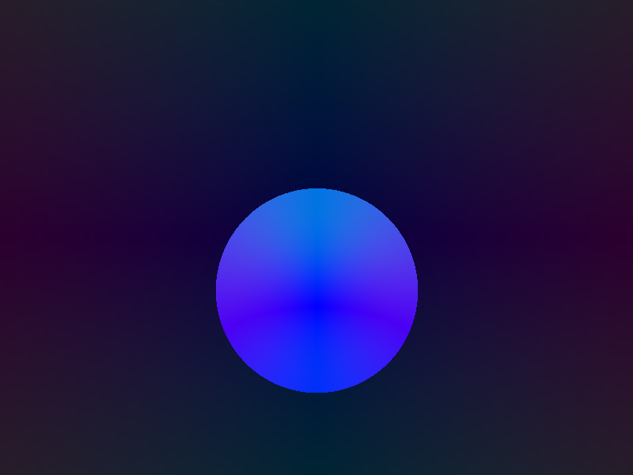
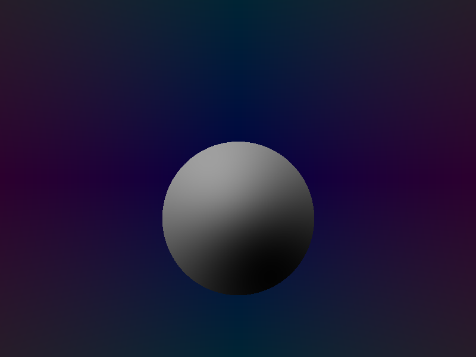
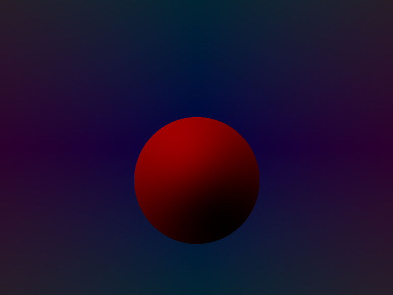

# Rusty Ray Tracer

## TODO

- [ ] Save to image
- [ ] Camera perspective
- [ ] Ray-Sphere intersection
- [ ] Ray-Plane intersection
- [ ] Depth-testing
- [ ] Composite objects
  - Union
  - Difference
  - Intersection
  - Complement
- [ ] Reflections
- [ ] Shadows

## Gallery

| Description | Date | Image |
| --- | ---  | --- |
| The first sphere! The normals are encoded in the colors | 2018-10-05 |  |
| On the second day, he created the sun | 2018-10-05 |  |
| Fancy colors | 2018-10-05 |  |

