# Rusty Ray Tracer

## TODO

- [X] Save to image
- [X] Camera perspective
- [X] Ray-Sphere intersection
- [X] Ray-Plane intersection
- [X] Depth-testing
- [X] Composite objects
  - Union
  - Difference
  - Intersection
  - Complement
- [X] Reflections
- [X] Shadows
- [ ] Remove unnecessary square roots

## Gallery

| Description | Date | Image |
| --- | ---  | --- |
| The first sphere! The normals are encoded in the colors | 2018-10-05 |  |
| On the second day, he created the sun | 2018-10-05 |  |
| Fancy colors | 2018-10-05 |  |
| Depth testing | 2018-10-05 | 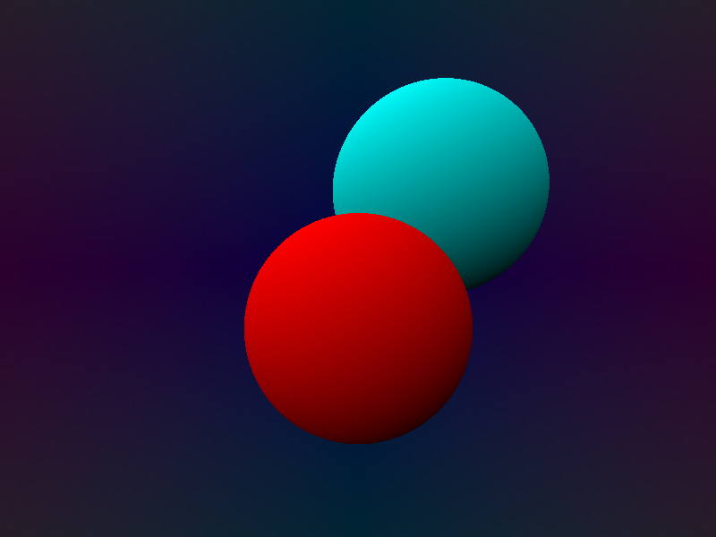 |
| It's time to start thinking *inside* the box | 2018-10-06 | 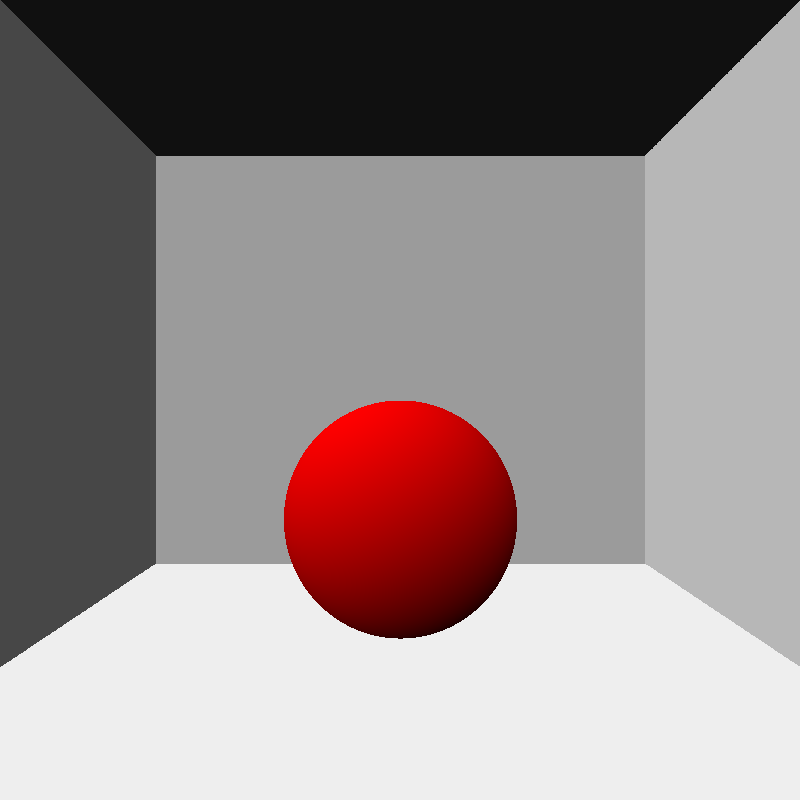 |
| Shadows are hard | 2018-10-06 | 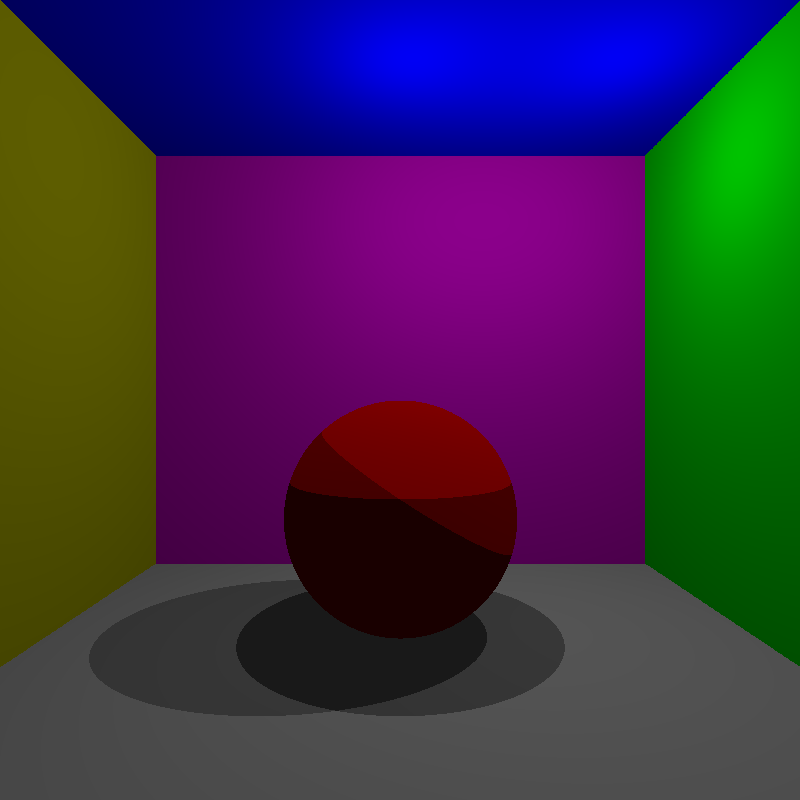 |
| Now they are soft! ...but kind of noisy | 2018-10-06 | 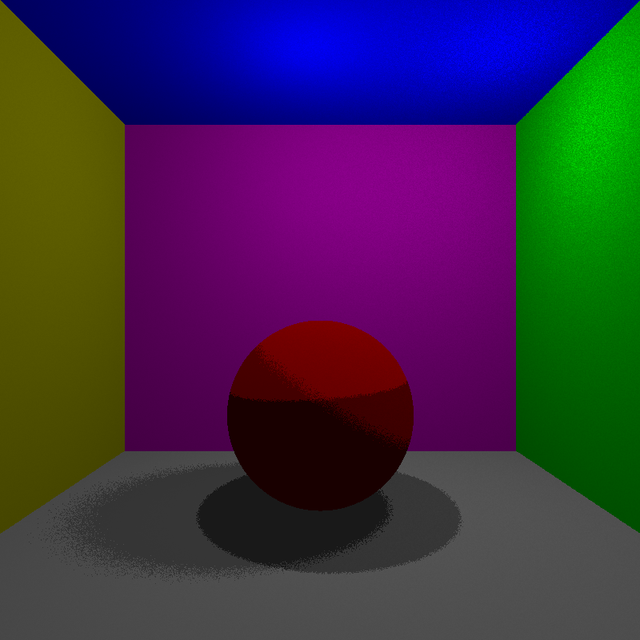 |
| That's better, although the render times aren't... | 2018-10-06 |  |
| Shiny! | 2018-10-06 | 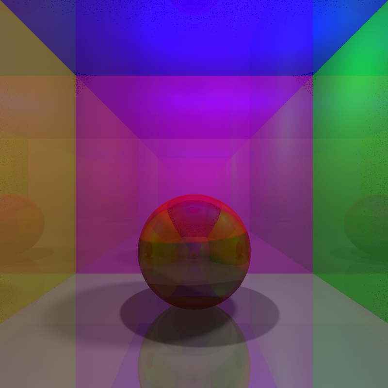 |
| It's a blur. These are starting to take a while to render... | 2018-10-06 | 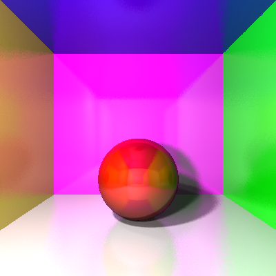 |
| Good enough | 2018-10-06 | 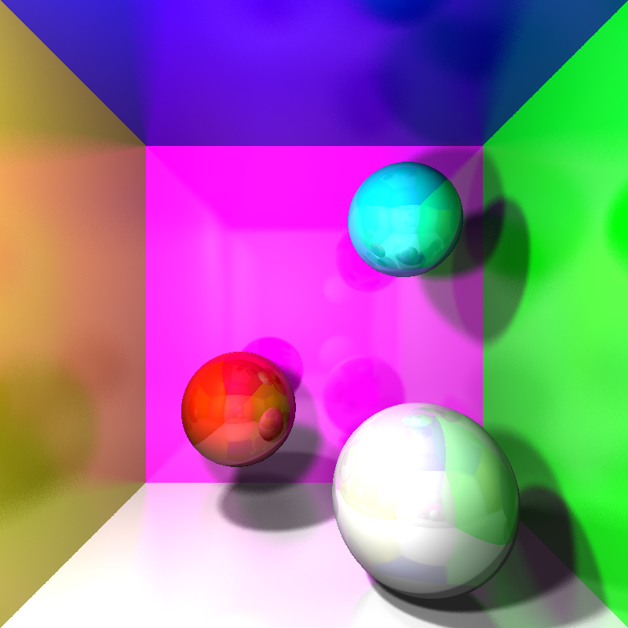 |
| Composite objects and drastically faster rendering times! | 2018-10-07 | 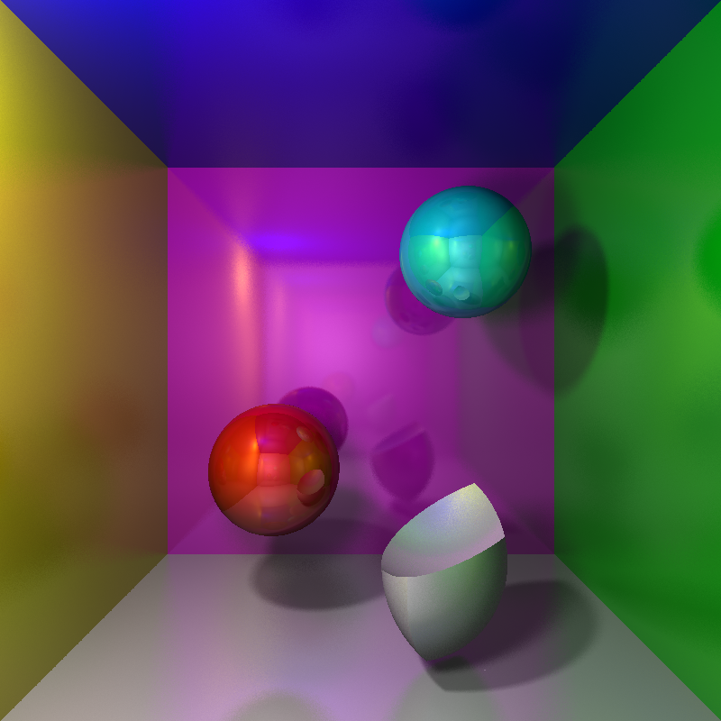 |
| Behold the power of downsampling: better quality and faster renders | 2018-10-07 | 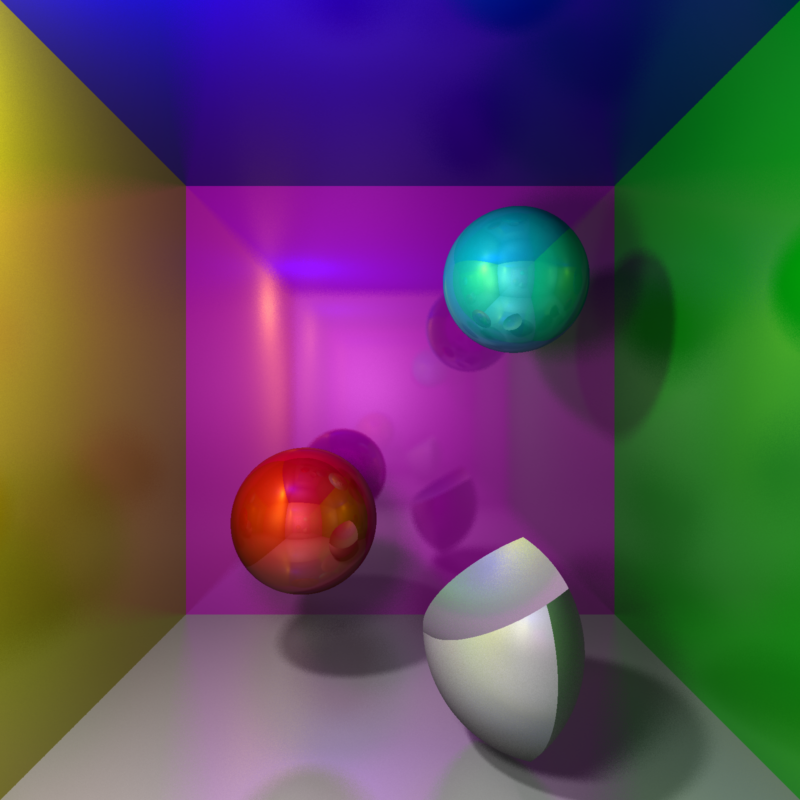 |
| Variable reflectiveness | 2018-10-07 | 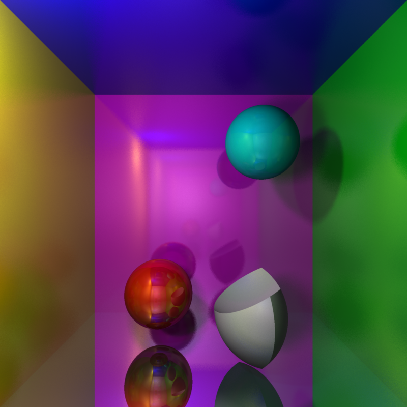 |
| Did somebody say infinite mirrors? | 2018-10-07 | 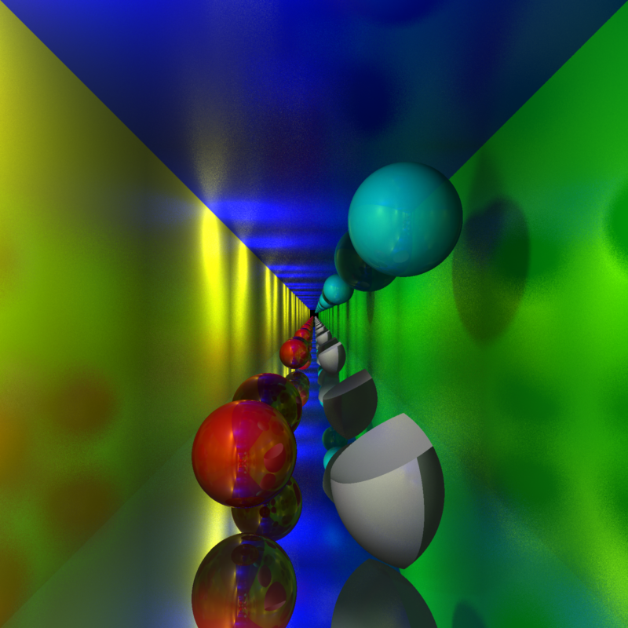 |

